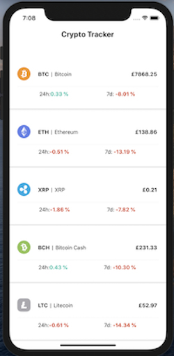
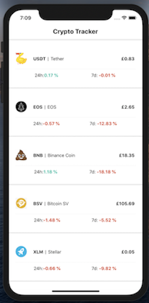

This is an app for tracking the top cryptocurrencies ordered by marketcap. It was a chance to introduce myself to and test a few new concepts including;

- [x] React-native framweworks for iOS and Android apps
- [x] Node.js
- [x] AWS Lamda functions and with Serverless framework
- [x] Expo modules
- [x] Using real-world APIs

Here are some screenshots of the final product. 

              

I chose not to deploy this project as it was more for the learning experience, moreover, it uses a sandbox API from CoinMarketCap which returns a snapshot of old market prices, making it fairly redundant if one wants to check real-time prices! 

You may notice some of the logos are incorrect. This is because I was spending too long trying to find specific logos that weren't included in a package I found - so instead decided to replace them with what you see. 

If you really must try the app please follow these instructions.

Clone or fork the repo.
Download an mobile simulator (I used Xcode). Or use Expo Snack (requires additional steps)
Run npm install
Follow terminal commands to open the app in whichever environment you fancy.

For a more in-depth write up please see (add link)

